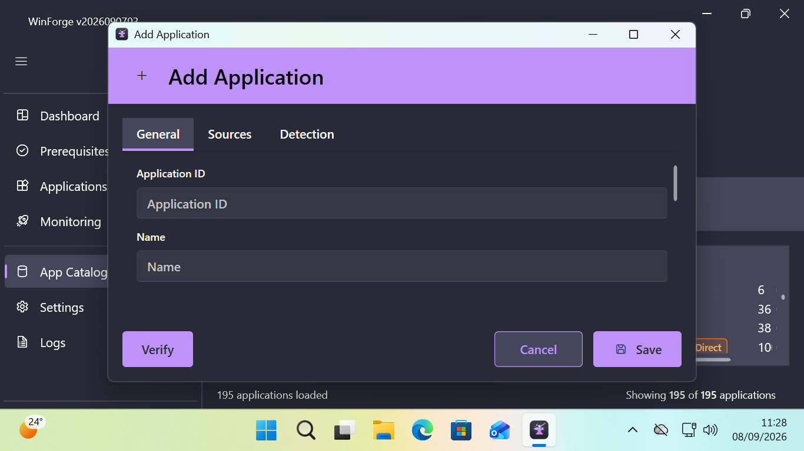
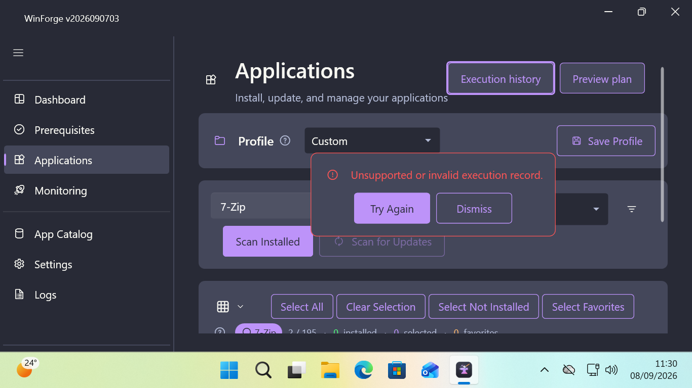
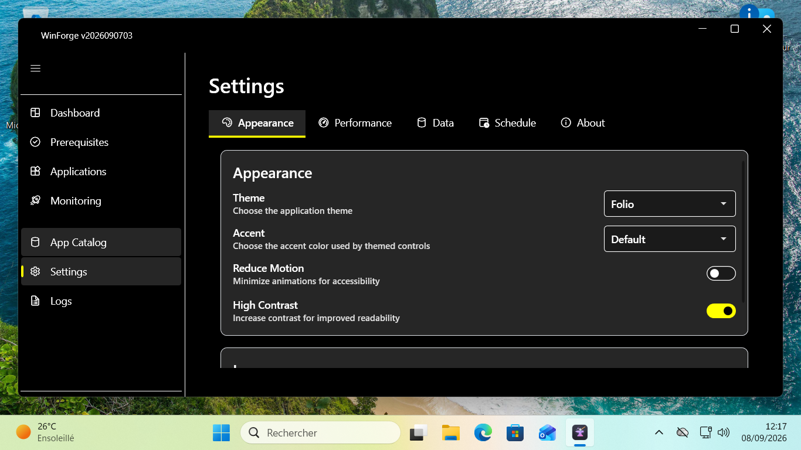
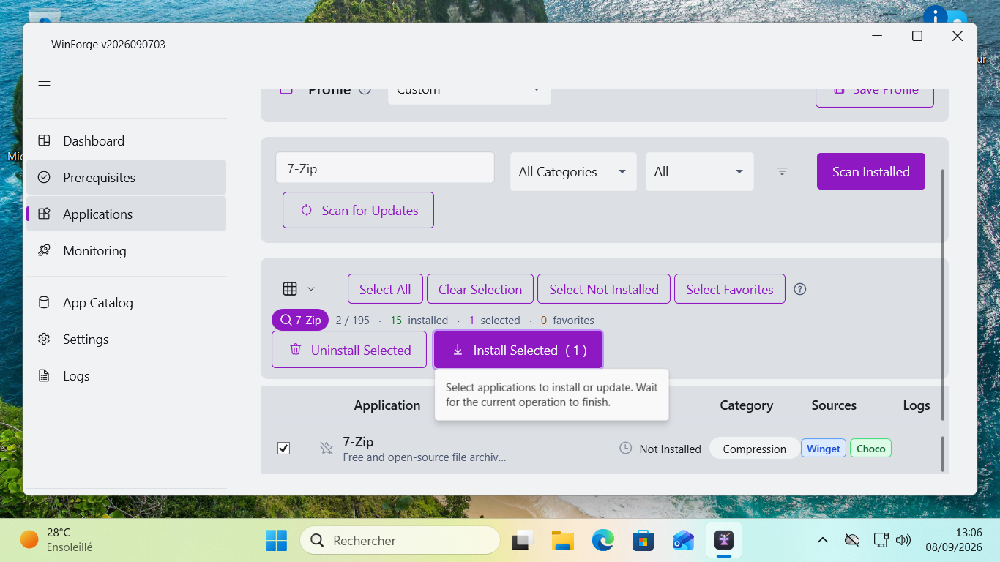

# Recette du backlog, 2026-09-08

[English](README.md) | [Validation de release](../../RELEASE_VALIDATION.fr.md)

Cette campagne suit la release publiée `v2026090703`
(`84cbc5d1d78698a750132499afd3c1033d49940d`). Les corrections GUI et celle de la
vérification du retour arrière sont locales, sans nouvelle release publiée.

## Preuves et périmètre

- [Matrice catalogue](catalog-installations.json) : les 195 entrées de la release,
  avec un statut par source configurée. `NotTested` ne constitue pas un succès.
- [Reçus catalogue](catalog-receipts.json) : installations réelles en VM VMware
  jetable, détection/version observées indépendamment, résultats du retour arrière
  et nettoyages séparés identifiés. Les empreintes des reçus originaux sont conservées.
- [Contrôle indépendant du nettoyage](catalog-cleanup.json) : les 21 applications
  absentes après le premier lot ; les reprises Firefox et 7-Zip GUI ont leurs reçus
  de nettoyage propres.
- [Parole émise](screen-reader.json) : empreintes audio, transcriptions horodatées,
  affichage effectif, parcours clavier et installation GUI réelle.
- [Identité du candidat](candidate.json) : empreinte identique côté hôte et invité,
  résultats de régression locaux. [Identité R8](candidate-r8.json) : candidat
  précédent, avant la dernière correction de placement du panneau d'erreur.
- Le registre canonique des actions reste Datacron `_memory/projects/win11forge.md`,
  section `Backlog canonique après v2026090703 - réconciliation 2026-09-08`.
  Ce dossier contient les preuves et ne crée pas une seconde liste d'actions.

Le lot comporte 21 essais : 20 installations avec version détectée indépendamment
et une détection de version incomplète (VLC). La matrice représente 195 applications
et 388 sources configurées. Les sources alternatives restent non testées.

Les essais utilisent Windows 11 Pro 25H2, initialement build 26200.8875. Un
redémarrage de nettoyage a appliqué une mise à jour en attente vers 26200.9168 ;
les reçus identifient le build concerné. La reprise Firefox précise l'utilisation
du module de retour arrière corrigé localement. Les versions sont observées le
2026-09-08, sans épinglage.
Les transcriptions, captures et fichiers audio bruts sont conservés localement dans
`Reports/backlog-20260908` et le partage dédié aux résultats de la VM jetable.

Contraste des badges clairs : [mesures](badge-contrast.json), [10 cas VM](badge-visual.json), [revue visuelle](badge-review.json), [candidat final](candidate-badges.json).

## Constats confirmés

| Domaine | Défaut observé | Correction ou traitement |
|---|---|---|
| Badges clairs | Les badges de source conservaient des couleurs sombres dans Folio et Parchment (contraste 1,00 à 1,21). | Palette claire appliquée, contraste 4,52 à 6,49 ; texte des badges secondaire et avertissement choisi selon leur fond. |
| DPI élevé | Contenu Apps trop court ; titre du catalogue et actions critiques Apps tronqués à 150 %. | Contenu défilant et retour à la ligne des en-têtes, filtres et actions. |
| Contraste élevé | Navigation claire, onglets et certaines ressources des champs/interrupteurs ne suivaient pas le contraste élevé. | Surcharges complètes des brosses sémantiques et restauration à la désactivation. |
| Placement de l'éditeur | Ouverture de l'éditeur hors de la zone de travail à 150 %. | Placement initial ajusté au moniteur de la fenêtre propriétaire. |
| Noms prononcés | NVDA prononçait les noms internes du fil d'Ariane, des thèmes/accents, des onglets et du modèle d'application. | Libellés de sélection localisés et noms explicites des onglets/actions. |
| Erreurs et progression | Panneau d'erreur d'historique invalide tronqué par la zone défilante ; progression sans nom d'automatisation descriptif. | Panneau de récupération complet placé hors de la zone défilante, nom de progression localisé et événements de région dynamique. |
| Retour arrière CLI | Firefox et Ditto renvoyaient zéro via WinGet alors que la détection trouvait encore l'application. | Détection fraîche d'absence obligatoire avant `RolledBack` ; résultat réessayable si l'absence n'est pas vérifiée. |

WinSCP, VS Code et SumatraPDF ont refusé une désinstallation WinGet élevée d'un
paquet utilisateur. Les nettoyages éditeur séparés ne valent pas succès du retour
arrière du plan. L'installation VLC a réussi mais sa détection configurée n'a pas
renvoyé de version : cet essai reste `DetectionIncomplete`.

## Limites de validation

La [matrice visuelle](visual-matrix.json) est validée sur ses 40 combinaisons :
les cinq couples résolution/DPI, Folio et Drakul, contraste élevé et mouvement
réduit activés/désactivés. Chaque cas couvre sept pages en fenêtre restaurée et
maximisée, quatre commandes critiques au clavier et la persistance après un
redémarrage réel. La [revue des captures](visual-review.json) complète les mesures.
Le groupe V10 à 150 % a été exclu après une dérive de résolution VMware ; les huit
reprises V11 ont réussi avec contrôle de l’affichage par page et en fin de parcours.

La matrice combine 32 cas V10 sur le [candidat précédent](candidate.json) et huit
cas V11 sur le [candidat final](candidate-badges.json). La dernière modification
porte uniquement sur les brosses des badges. Les [10 reprises ciblées](badge-visual.json)
couvrent Folio et Parchment aux cinq couples résolution/DPI sur ce candidat final.
Les [mesures de contraste](badge-contrast.json) passent de 1,00–1,21 à 4,52–6,49
pour les quatre badges de source ; les neuf paires de badges testées dans chacun
des thèmes clairs respectent 4,5:1. Ce contrôle ne certifie pas chaque couleur
d’accent personnalisée ni chaque état de chaque contrôle.

NVDA 2026.2 avec eSpeak NG 1.52.0 a réellement prononcé les champs source et
détection, l'aperçu, l'historique, l'erreur de reçu invalide, la progression et la
réussite d'une installation réelle. R8 est mesuré à 125 %, après réinitialisation
du DPI effectif par Windows ; il n'est pas classé comme résultat à 150 %. R9 vérifie
le placement corrigé de l'éditeur, la parole de l'erreur et les boutons de
récupération complets à 150 % mesurés.

Le segment R5 affecté par une erreur audio NVDA est exclu. Les journaux R8/R9 ne
contiennent pas cette erreur. Les transcriptions automatiques peuvent comporter
des erreurs phonétiques ; elles sont associées aux observations UIA indépendantes
et aux empreintes audio réelles. La validation porte sur les parcours NVDA
enregistrés, sans certification de chaque contrôle, langue, aide technique ou
dialogue non enregistré. UIA seul ne prouve pas la parole.

Contrôles locaux après corrections : 790 tests .NET réussis ; 2 006 tests Pester
réussis, aucun échec, six ignorés. Ces résultats locaux sont distincts de la CI de
la release publiée.

Le lot progressif ne certifie ni les 195 applications ni leurs sources alternatives.
LDPlayer reste indisponible dans la source WinGet vérifiée. Le retour arrière couvre
uniquement les nouveaux paquets pris en charge, sans restauration d'anciennes
versions ou de configuration Windows. Reçus GUI et plans CLI restent distincts.

Les [reçus des tests de régression](regression-tests.json) conservent les compteurs
et empreintes des rapports, y compris les deux échecs attendus avant correction.

La [restauration de la VM](vm-restoration.json) confirme les octets du fichier
de réglages initial, les préférences DPI sauvegardées et la suppression des tâches
de recette après reconnexion. Les 21 applications essayées sont absentes au dernier
contrôle indépendant. La mise à jour Windows, le périphérique audio de recette
et les outils/preuves portables sont conservés dans cette VM jetable.
Analyse PowerShell : 160 fichiers, zéro erreur, neuf avertissements dans des
fichiers inchangés ; aucun signalement dans les deux fichiers PowerShell modifiés.
